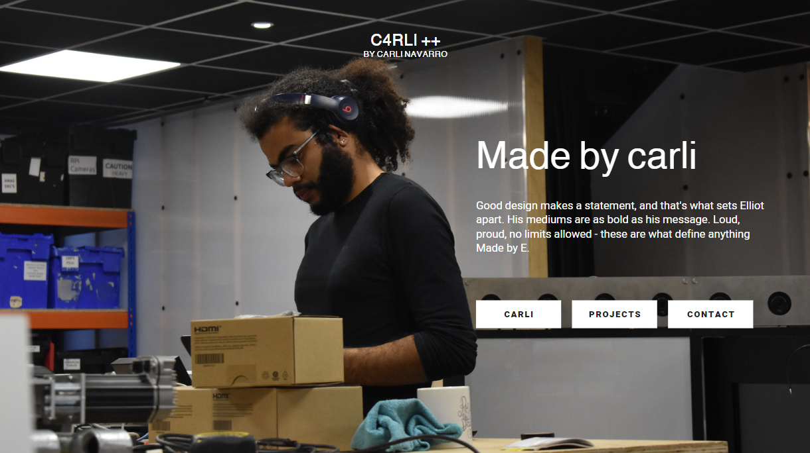
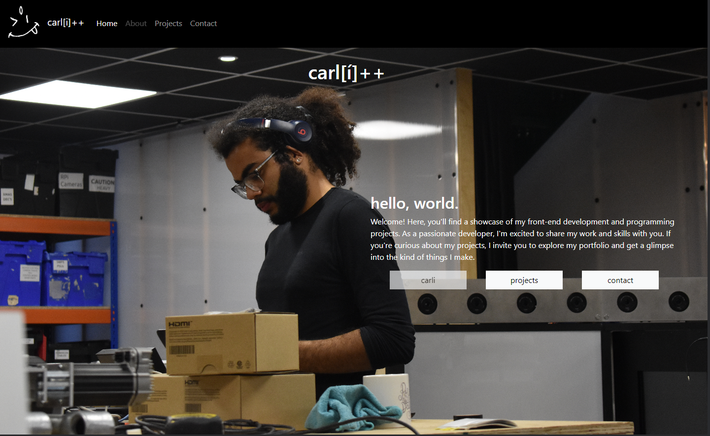

# c4rli++'s Portfolio
A portfolio showcasing my recent projects built using React.js and Bootstrap.

## Description
This repo contains source code for my personal development portfolio built using React.

### My User Story:
```
I want to try a new challenging 'artsy' approach to using the functionalities of React and Bootstrap.
The page will feature a home splash page, a section with my skills, my contact details and previous and future projects.

Must have:
- Navigation using React Router.
- Header
- Home page
- Projects page
- Project (on Projects page)
- Contact page
```

### Features:
- Single page application, loads all content on page launch.
- Renders projects dynamically based on the information in the `projectData.json`
- React Router for easy navigation of pages.
- Responsive for Large Laptop, Tablet and Mobile phone displays.

### Wireframe:

### Preview of webpage:


## Installation
N/A

## Usage
Deployed webpage can be found here:  [c4rli's bootstrap portfolio - home](https://c4rli.github.io/Bootcamp-Challenge-3-Bootstrap-Portfolio/)

## Credits
Source code written by carli n. aka c4rli ++

## License
Please refer to the LICENSE in the repo.